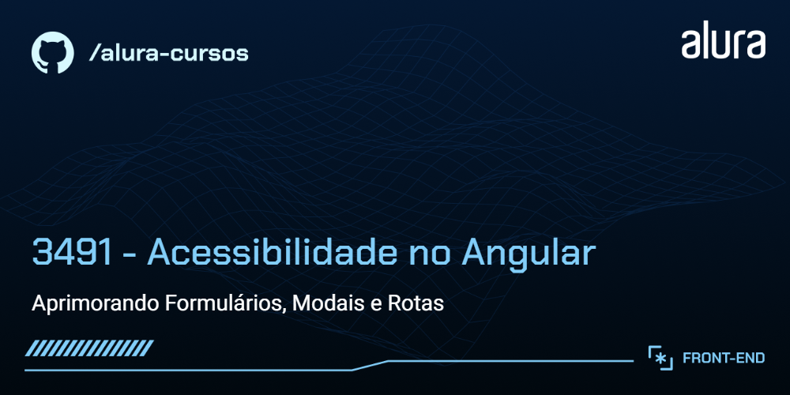

# 📚 Sobre

O projeto visa implementar estratégias de acessibilidade para tornar o Buscante uma aplicação mais inclusiva e acessível, desenvolvido durante o curso Acessibilidade no Angular da *Alura*.

# Buscante

Aplicação que permite pesquisar e descobrir livros utilizando a API do Google Books. 

## 🔨 Funcionalidades do projeto

### Pesquisa de Livros:

As pessoas podem inserir palavras-chave na barra de pesquisa para buscar livros de forma dinâmica.

### Detalhes do Livro:

Ao clicar em um livro específico pode-se obter mais detalhes, como título, sinopse, autoria e outras informações fornecidas pela API do Google Books.

### Link para ler prévia do livro:

Link com opção de ler uma prévia do livro.

## ✔️ Técnicas e tecnologias utilizadas

As técnicas e tecnologias utilizadas foram:

- `Angular`
- `Google Books API`
- `RxJs`

## 🛠️ Abrir e rodar o projeto

Para abrir e rodar o projeto, execute *npm i* para instalar as dependências e *ng serve* para iniciar o projeto.

Depois, acesse [http://localhost:4200/](url) no seu navegador. 

## 📁 Créditos

Você pode [acessar o código fonte do projeto inicial](https://github.com/nayannelbatista/3491-angular-a11y) ou [baixá-lo](https://github.com/nayannelbatista/3491-angular-a11y/archive/refs/heads/projeto-base.zip).